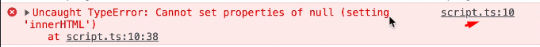
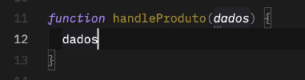
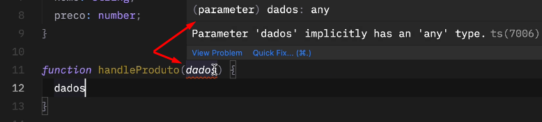
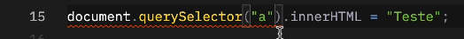
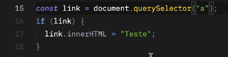
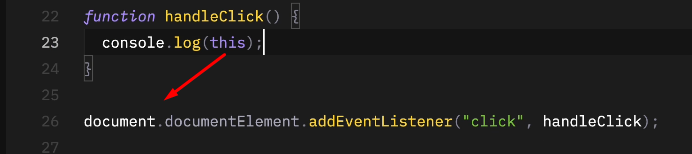
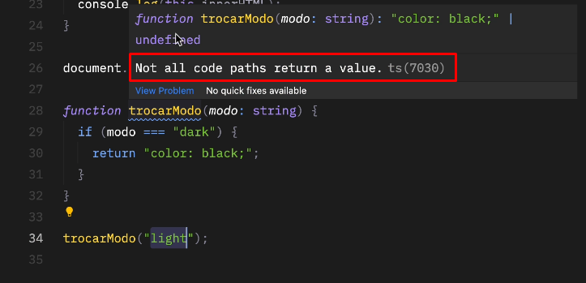
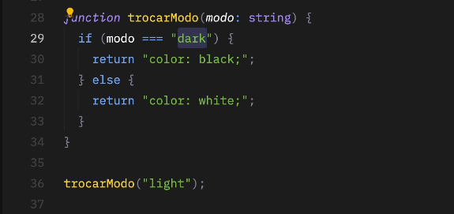
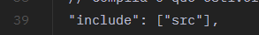
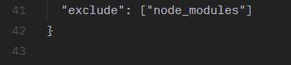

# About

Parte 4 do curso de Typescript da Origamid, lecionado pelo André Rafael.

Agora, entraremos mais em classes, tuples, keyof e objetos.

Caso tenha alguma dúvida, recorra à [Parte 1](), [parte 2](), [parte 3]().

# Introdução

Aqui, falaremos mais sobre o ambiente de desenvolvimento com TS!

# Tsconfig

Existem diversas opções do compilador do TypeScript. 

Algumas vão influenciar no código gerado e outras nas indicações de erros pelo TS.

[Demais configurações](https://www.typescriptlang.org/tsconfig/)


## compileOnSave

Compila o arquivo ao salvar, por padrão é true.

Toda vez que salvamos nosso arquivo TS, compilará gerando automaticamente o arquivo JS.

## compilerOptions

### target

Utilizamos o "ESNext", ou seja, irá utilizar (compilar) o arquivo na última versão possível do JavaScript.

### module

Também usaremos "ESNext". Isso é mais específico para quando estamos trabalhando com Node.

Como estamos trabalhando com JS diretamente pelo browser, sempre manteremos o "ESNext", para que possamos exportar
e importar outros plugins.

### lib (biblioteca)

Por padrão será "ESNext" e "DOM". Isso permite que ao entrar em um arquivo ts/js qualquer, possamos usar, por exemplo,
um ``document.querySelector`` (DOM) ou Arrays, promises para o JS (ESNext).

### sourceMap

Por padrão será true.

Imagine que escrevemos um erro na linha 10 do nosso arquivo TS.

Caso o sourceMap esteja false, ele não irá mostrar esse erro no console no arquivo TS e sim no JS (que é compilado). Além
disso, o erro no arquivo JS, não necessariamente estará na linha 10.

O sourceMap consegue indicar, portanto, que, o erro está na linha 10 do nosso arquivo TS.



### noEmit

Por padrão é false. Caso a gente coloque true, ele não irá mais compilar o arquivo TS para JS (atualizando eventuais
alterações feitas).

### allowJS

Nos permite importar plugins (arquivo JS) para dentro de um arquivo TS.

### removeComments

Comentários feitos no arquivo TS não serão compilados para o arquivo JS.

### strict

Inclui diversas configurações diferentes e iremos abordá-las abaixo. Portanto, **se strict for true, todas as configurações
abaixo, também serão true.**

### isolatedModules

Garante que não teremos variáveis globais. Precisa ter import/export (ter um módulo).

#### noImplicitAny

É importante utilizar e deixar true.


Ao passar como parâmetro somente o nome, sem tipo, explicitamente ele será any, **porem não dará nenhum erro**:



---
Quando colocamos como true, ele nos mostra isso com erro, dizendo que devemos indicar o valor:



#### alwaysStrict

É importante utilizar e deixar true.

Adiciona o "use strict" ao JavaScript.

#### strictNullChecks

É importante utilizar e deixar true.

Verifica a possibilidade do dado ser null ou undefined.

Não funciona: 



---

Devemos checar com o if:



#### noImplicitThis

Sabemos que quando fazemos essa chamada abaixo utilizando this na função, ele está fazendo referência ao elemento
que o chama:



Utilizando true em "noImplicitThis", nós somos OBRIGADOS a declarar o this como parâmetro na função de callback. Ele
será sempre o primeiro parâmetro, veja:


OBS: precisa ser this, se colocássemos "e" ao invés de this, estaríamos acessando o evento! Além disso, podemos até
mesmo indicar o que ele vai ser, no nosso caso, document seria um HTMLElement.

#### noImplicitReturns

É importante utilizar e deixar true.


Ao colocar como true, irá indicar a possibilidade de um retorno undefined.

Imagine que a nossa função precisa retornar algo específico, mas em algum momento ela chega num if-else que não existe
e retorna undefined? **Com essa propriedade true, ele não deixa isso acontecer**.

Olhe o exemplo abaixo, criamos uma função para retornar uma string com a cor black para um modo escuro. Entretanto,
ao chamarmos a função passamos uma opção diferente que não está no if, "light".

O próprio programa nos diz que existe um caminho que não retorna um valor, no caso: undefined.



---

Ao colocarmos outro bloco condicional para verificar possíveis variáveis, isso some:



#### noUnusedLocals e noUnusedParameters

Não deixa a gente declarar um parâmetro ou variável e não utilizar, por exemplo.

**O não uso dessas variáveis não é um erro, é só um highlight que ele deixa no código.**


## include

Isso já é fora do compilador.

Compila o que estiver na pasta que passarmos ali dentro.



## exclude

Não compila o que estiver dentro da pasta que você colocar dentro.



## Alocando arquivos JS compilados em outra pasta

A última propriedade interessante utilizar é "outDir". Nela, podemos alocar os arquivos compilados (de TS para JS) em 
uma pasta, para que possamos subir depois no site.


# Como o TS lida com o type-module?

Se usarmos o import/export em qualquer momento em um arquivo .ts, o TypeScript irá tratar o mesmo como o module. 

Consequentemente, o seu escopo não será mais global.

Ou seja: usamos import/export, o TS entende que será criado um arquivo JS (que será utilizado como módulo) a partir do
arquivo TS.

**Se não tiver import/export, o arquivo TS será tratado como um arquivo global.**

Vamos para a prática:

Imagine que criamos um script chamado ``pluginSlide.ts`` que terá uma função:

```ts
// pluginSlide.ts
function pluginSlide(seletor: string) {
  console.log(`Criar slide: ${seletor}`);
}
```

Se quiséssemos utilizar essa função dentro do ``script.ts``, poderíamos fazer de duas formas:

## Primeira

Carregar o outro script no HTML (antes do script principal):

```html
<body>
  <script src="./dist/global.js"></script>
  <script type="module" src="./dist/script.js"></script>
</body>
```

Ou, podemos importar!

## Segunda

Passamos o export no plugin:

```ts
// pluginSlide.ts
function pluginSlide(seletor: string) {
  console.log(`Criar slide: ${seletor}`);
}

export default pluginSlide;
```

E no arquivo main, importamos ele:

```ts
//script.ts

import pluginSlide from './pluginSlide.js';
```


## Resumo

Apareceu import/export no TS, ele vira type-module.

Se é type-module, variáveis não ficam mais acessíveis/no escopo global, teríamos também que exportá-las.

```ts
// script.ts

const URL_BASE = 'http://api.origamid.dev/json' //errado, não será possível acessar em outro arquivo

export const URL_BASE1 = 'http://api.origamid.dev/json' //correto
```

```ts
// pluginSlide.ts

import {URL_BASE} from './script.js';
```

Com os imports feitos, PRECISAMOS passar no HTML que o script.js será ``type=module``.

Para que a gente não fique criando arquivo globais, podemos usar no ``tsconfig`` a propriedade [isolatedModules](#isolatedmodules).

Ela irá nos obrigar importar/exportar as coisas!

# Declaration files

Podemos criar arquivos **focados apenas na declaração de tipos e interfaces**, estes devem ser terminados em ``.d.ts``.

Como ele é focado só nisso, o TypeScript não irá compilar eles, mas os tipos declarados poderão ser utilizados globalmente
na aplicação.

Esse tipo de declaração é comum em bibliotecas criadas em JavaScript que desejam dar suporte ao uso da mesma em TypeScript.

Vejamos o exemplo abaixo:

```ts
// arquivo para alocar a interface: global.d.ts
interface Produto {
  nome: string;
}

// utilizando a interface do arquivo global em script.ts
const livro: Produto = {
    nome: 'O Senhor dos Anéis',
};
```

Um adendo: crie uma pasta específica para arquivos do tipo ``.d.ts``, pois o TS ignora arquivos que possuem o mesmo nome
e diretório (ele irá priorizar o arquivo que terminar em ``.ts``).

Para gerar arquivos ``.d.ts`` automaticamente, coloque ``declaration: true`` dentro de [compilerOptions](#compileroptions)

## Não precisa necessariamente criar um arquivo

Não é necessário criar um arquivo global ou ``.d.ts`` para ter um tipo global. É possível declarar também dentro de um
arquivo do tipo module, usando o ``declare global {}``, veja:

```ts
declare global {
  interface Produto {
    nome: string;
    preco: number;
  }
  
  //poderia ter outras interfaces ou types
}

//precisa ter o export para se tornar um arquivo module
export const livro: Produto = {
    nome: 'O Senhor dos Anéis',
    preco: 200,
};
```

Com isso acima, poderíamos criar outro arquivo ``.ts`` e utilizar da interface Produto:

```ts
//arquivo .ts qualquer

const livro: Livro = {
    nome: 'Outro livro', 
    preco: 400,
};
```

## Problema com tipo global (overwriting)

Declaração global de types tem o mesmo problema que temos em variáveis globais: outras pessoas podem escrever por cima
delas.

Então se, por exemplo, temos um arquivo ``global.d.ts`` com uma interface:

```ts
//global.d.ts
interface Produto {
    nome: string;
    preco: number;
    cor: string;
}
```

E daí vamos para o ``script.ts``, e escrevemos a mesma interface s**em a propriedade cor e o preço como string**:

```ts
//script.ts

interface Produto {
    nome: string;
    preco: string;
}
```

**Ele irá ignorar a interface do arquivo global e basicamente, criar uma outra interface para Produto.**

# Bibliotecas externas

Ao usarmos uma biblioteca externa criada em JavaScript, o TS não consegue identificar automaticamente a interface da mesma.

Para isso, milhares de projetos fornecem para instalação seus arquivos ``.d.ts``, assim, o TS passa a reconhecer a interface
da mesma.

Ou, podemos utilizar o projeto [Definitely Typed](https://github.com/DefinitelyTyped/DefinitelyTyped). Ele irá basicamente
pegar uma biblioteca em JS e transformá-la para TS (arquivo ``.d.ts``).

Para instalar, é só rodar um npm, exemplo: ``@types/nome-da-biblioteca``

Exemplo para o Lodash:

```bash
npm install --save-dev @types/lodash
```

Lembrar de no HTML, importar o plug-in:

```html
<!-- index.html -->
<script src="./plugins/jquery-3.6.1.min.js"></script>
<script src="./plugins/lodash.min.js"></script>
<script type="module" src="./dist/script.js"></script>
```

## Exemplos de bibliotecas suportadas

Algumas das bibliotecas populares que têm tipos no DefinitelyTyped:

- @types/react → Tipos para React
- @types/express → Tipos para Express.js
- @types/node → Tipos para APIs do Node.js
- @types/jquery → Tipos para jQuery

## E se não existir um tipo para a biblioteca?

Imagine que você usa uma biblioteca externa na sua empresa e você está migrando para TS e não temos a definição de tipo
dela e ninguém nem mesmo criou uma?

Bom, a própria biblioteca nos auxilia a isso em sua documentação, vejamos o exemplo do VIMEO:

1. Adicionaríamos ele no HTML, colocando uma ID:

```html
<iframe id="vimeo" src="https://player.vimeo.com/video/76979871?h=8272103f6e" width="640" height="360" frameborder="0" allowfullscreen allow="autoplay; encrypted-media"></iframe>
```

2. Selecionamos a ID no TS e instanciamos um Player, alocando o que pegamos com ID:

```ts
const iframe = document.getElementById('vimeo');
const player = new Vimeo.Player(iframe);
```

Entretanto, para que isso funcione corretamente precisamos declarar o Vimeo para que o TS reconheça, basta fazer um
"declare":

```ts
declare const Vimeo: any;
const iframe = document.getElementById('vimeo');
const player = new Vimeo.Player(iframe);
```

# Ferramentas Front

## Vite

É uma ferramenta desenvolvida para automação do Front End. Com ela podemos gerar bundles, iniciar um live server,
otimizar código para produção e mais.

```bash
npm create vite@latest .

// vanilla / typescript
```

Depois, seleciona o tipo de framework, se for vanilla escolha entre JS e TS, depois siga os passos abaixo ⬇️

```bash
//dentro da pasta

npm install
npm run dev
npm run build
```