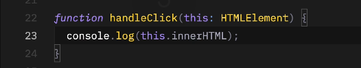

# About

Parte 4 do curso de Typescript da Origamid, lecionado pelo André Rafael.

Agora, entraremos mais em classes, tuples, keyof e objetos.

Caso tenha alguma dúvida, recorra à [Parte 1](), [parte 2](), [parte 3]().

# Introdução

Aqui, falaremos mais sobre o ambiente de desenvolvimento com TS!

# Tsconfig

Existem diversas opções do compilador do TypeScript. 

Algumas vão influenciar no código gerado e outras nas indicações de erros pelo TS.

## compileOnSave

Compila o arquivo ao salvar, por padrão é true.

Toda vez que salvamos nosso arquivo TS, compilará gerando automaticamente o arquivo JS.

## compilerOptions

### target

Utilizamos o "ESNext", ou seja, irá utilizar (compilar) o arquivo na última versão possível do JavaScript.

### module

Também usaremos "ESNext". Isso é mais específico para quando estamos trabalhando com Node.

Como estamos trabalhando com JS diretamente pelo browser, sempre manteremos o "ESNext", para que possamos exportar
e importar outros plugins.

### lib (biblioteca)

Por padrão será "ESNext" e "DOM". Isso permite que ao entrar em um arquivo ts/js qualquer, possamos usar, por exemplo,
um ``document.querySelector`` (DOM) ou Arrays, promises para o JS (ESNext).

### sourceMap

Por padrão será true.

Imagine que escrevemos um erro na linha 10 do nosso arquivo TS.

Caso o sourceMap esteja false, ele não irá mostrar esse erro no console no arquivo TS e sim no JS (que é compilado). Além
disso, o erro no arquivo JS, não necessariamente estará na linha 10.

O sourceMap consegue indicar, portanto, que, o erro está na linha 10 do nosso arquivo TS.

### noEmit

Por padrão é false. Caso a gente coloque true, ele não irá mais compilar o arquivo TS para JS (atualizando eventuais
alterações feitas).

### allowJS

Nos permite importar plugins (arquivo JS) para dentro de um arquivo TS.

### removeComments

Comentários feitos no arquivo TS não serão compilados para o arquivo JS.

### strict

Inclui diversas configurações diferentes e iremos abordá-las abaixo. Portanto, **se strict for true, todas as configurações
abaixo, também serão true.**

#### noImplicitAny

É importante utilizar e deixar true.

Ao passar como parâmetro somente o nome, sem tipo, explicitamente ele será any, **porem não dará nenhum erro**:

---
Quando colocamos como true, ele nos mostra isso com erro, dizendo que devemos indicar o valor:

#### alwaysStrict

É importante utilizar e deixar true.

Adiciona o "use strict" ao JavaScript.

#### strictNullChecks

É importante utilizar e deixar true.

Verifica a possibilidade do dado ser null ou undefined.

Não funciona: 

---

Devemos checar com o if:

#### noImplicitThis

Sabemos que quando fazemos essa chamada abaixo utilizando this na função, ele está fazendo referência ao elemento
que o chama:

Utilizando true em "noImplicitThis", nós somos OBRIGADOS a declarar o this como parâmetro na função de callback. Ele
será sempre o primeiro parâmetro, veja:

OBS: precisa ser this, se colocássemos "e" ao invés de this, estaríamos acessando o evento! Além disso, podemos até
mesmo indicar o que ele vai ser, no nosso caso, document seria um HTMLElement.

#### noImplicitReturns

É importante utilizar e deixar true.

Ao colocar como true, irá indicar a possibilidade de um retorno undefined.

Imagine que a nossa função precisa retornar algo específico, mas em algum momento ela chega num if-else que não existe
e retorna undefined? **Com essa propriedade true, ele não deixa isso acontecer**.

Olhe o exemplo abaixo, criamos uma função para retornar uma string com a cor black para um modo escuro. Entretanto,
ao chamarmos a função passamos uma opção diferente que não está no if, "light".

O próprio programa nos diz que existe um caminho que não retorna um valor, no caso: undefined.

---

Ao colocarmos outro bloco condicional para verificar possíveis variáveis, isso some:

#### noUnusedLocals e noUnusedParameters

Não deixa a gente declarar um parâmetro ou variável e não utilizar, por exemplo.

**O não uso dessas variáveis não é um erro, é só um highlight que ele deixa no código.**

[Demais configurações](https://www.typescriptlang.org/tsconfig/)

###

## include

Isso já é fora do compilador.

Compila o que estiver na pasta que passarmos ali dentro.

## exclude

Não compila o que estiver dentro da pasta que você colocar dentro.

## Alocando arquivos JS compilados em outra pasta

A última propriedade interessante utilizar é "outDir". Nela, podemos alocar os arquivos compilados (de TS para JS) em 
uma pasta, para que possamos subir depois no site.

